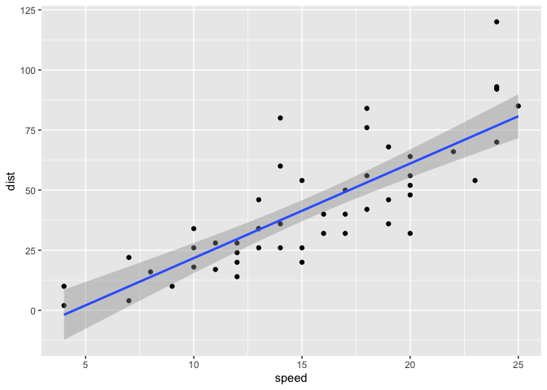
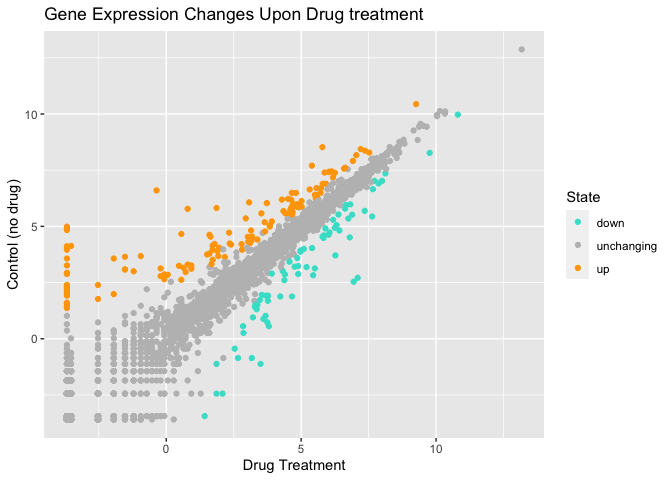
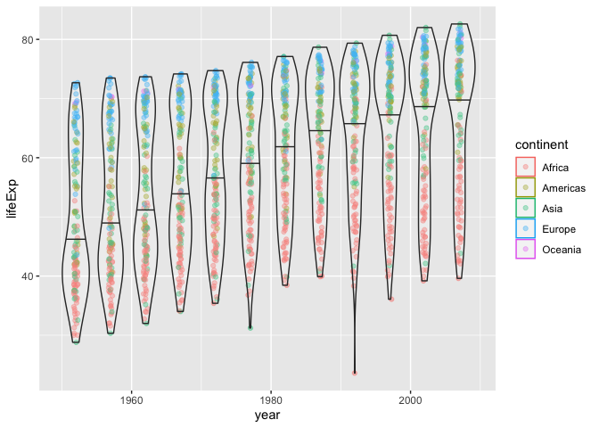
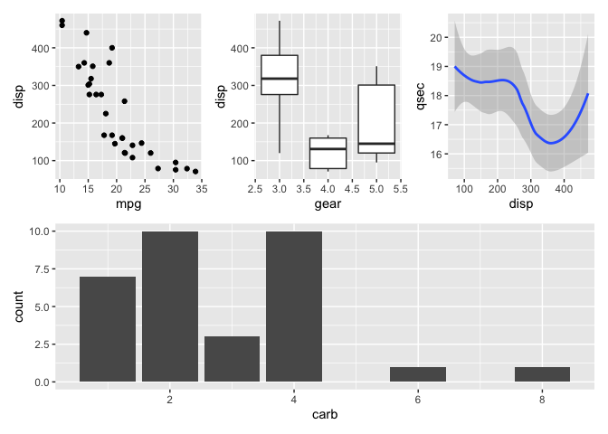

Class05: Data Visualization
================
Jose Chacon
October 13, 2021

``` r
#Today we are going to use ggplot2 package

#First we need to load the package! 
# install.packages("ggplot2")
library(ggplot2)

#We will use this inbuilt "cars" dataset first
head(cars)
```

    ##   speed dist
    ## 1     4    2
    ## 2     4   10
    ## 3     7    4
    ## 4     7   22
    ## 5     8   16
    ## 6     9   10

``` r
#All ggplots have at least 3 layers,
# data +aes +geoms
ggplot(data=cars) +
  aes(x=speed, y=dist) + 
  geom_point() +
  geom_smooth(method="lm")
```

    ## `geom_smooth()` using formula 'y ~ x'

<!-- -->

``` r
  labs(title="Stopping Distance of Old Cars",
       x="Speed(MPH)",
       y="stopping Distance(ft)")
```

    ## $x
    ## [1] "Speed(MPH)"
    ## 
    ## $y
    ## [1] "stopping Distance(ft)"
    ## 
    ## $title
    ## [1] "Stopping Distance of Old Cars"
    ## 
    ## attr(,"class")
    ## [1] "labels"

``` r
#side note ggplot is not the only graphics system
#a very popular one is good old "base" R graphics
plot(cars)
```

<!-- -->

``` r
#New dataset from bioboot
url <- "https://bioboot.github.io/bimm143_S20/class-material/up_down_expression.txt"
genes <- read.delim(url)
head(genes)
```

    ##         Gene Condition1 Condition2      State
    ## 1      A4GNT -3.6808610 -3.4401355 unchanging
    ## 2       AAAS  4.5479580  4.3864126 unchanging
    ## 3      AASDH  3.7190695  3.4787276 unchanging
    ## 4       AATF  5.0784720  5.0151916 unchanging
    ## 5       AATK  0.4711421  0.5598642 unchanging
    ## 6 AB015752.4 -3.6808610 -3.5921390 unchanging

``` r
#Q. Number of genes indicated by row?
nrow(genes)
```

    ## [1] 5196

``` r
#Q. Number of columns?
ncol(genes)
```

    ## [1] 4

``` r
#Q. How many genes are upregulated?
table(genes$State)
```

    ## 
    ##       down unchanging         up 
    ##         72       4997        127

``` r
#Q. What % are up?
#x <- (127/5196)*(100)
round(table(genes$State)/nrow(genes) * 100, 2)
```

    ## 
    ##       down unchanging         up 
    ##       1.39      96.17       2.44

``` r
#Lets make a figure
p <- ggplot(genes) +
  aes(x=Condition1, y= Condition2, col=State) +
  scale_colour_manual( values=c("turquoise","grey","orange") ) +
  geom_point() 

#Color choice below
#p + scale_colour_manual( values=c("turquoise","grey","orange") )
p + labs(title="Gene Expression Changes Upon Drug treatment", x= "Drug Treatment", y= "Control (no drug)")
```

<!-- -->

``` r
#OPTIONAL Let's explore the gapminder dataset
#install.packages("gapminder")
library(gapminder)
head(gapminder)
```

    ## # A tibble: 6 × 6
    ##   country     continent  year lifeExp      pop gdpPercap
    ##   <fct>       <fct>     <int>   <dbl>    <int>     <dbl>
    ## 1 Afghanistan Asia       1952    28.8  8425333      779.
    ## 2 Afghanistan Asia       1957    30.3  9240934      821.
    ## 3 Afghanistan Asia       1962    32.0 10267083      853.
    ## 4 Afghanistan Asia       1967    34.0 11537966      836.
    ## 5 Afghanistan Asia       1972    36.1 13079460      740.
    ## 6 Afghanistan Asia       1977    38.4 14880372      786.

``` r
#Let's make a new plot of your year vs life Exp
ggplot(gapminder) +
  aes(x=year, y=lifeExp, col=continent) +
  geom_jitter(width=0.3, alpha=0.4) +
  geom_violin( aes(group=year), alpha=0.2,
               draw_quantiles = 0.5)
```

<!-- -->

``` r
# Install the plotly
#Install.packages("plotly")
#plotly is unavailable for pdf
#library(plotly)
#ggplotly()


  # install.packages("dplyr")
library(dplyr)
```

    ## 
    ## Attaching package: 'dplyr'

    ## The following objects are masked from 'package:stats':
    ## 
    ##     filter, lag

    ## The following objects are masked from 'package:base':
    ## 
    ##     intersect, setdiff, setequal, union

``` r
gapminder_2007 <- gapminder %>% filter(year==2007)
#trouble with running code
gapminder_2007
```

    ## # A tibble: 142 × 6
    ##    country     continent  year lifeExp       pop gdpPercap
    ##    <fct>       <fct>     <int>   <dbl>     <int>     <dbl>
    ##  1 Afghanistan Asia       2007    43.8  31889923      975.
    ##  2 Albania     Europe     2007    76.4   3600523     5937.
    ##  3 Algeria     Africa     2007    72.3  33333216     6223.
    ##  4 Angola      Africa     2007    42.7  12420476     4797.
    ##  5 Argentina   Americas   2007    75.3  40301927    12779.
    ##  6 Australia   Oceania    2007    81.2  20434176    34435.
    ##  7 Austria     Europe     2007    79.8   8199783    36126.
    ##  8 Bahrain     Asia       2007    75.6    708573    29796.
    ##  9 Bangladesh  Asia       2007    64.1 150448339     1391.
    ## 10 Belgium     Europe     2007    79.4  10392226    33693.
    ## # … with 132 more rows

``` r
ggplot(gapminder_2007) +
  aes(x=gdpPercap, y= lifeExp)+
  geom_point()
```

<!-- -->

``` r
# Assignment 9 - Combining plots
#install.packages('patchwork')
library(patchwork)

# Setup some example plots 
p1 <- ggplot(mtcars) + geom_point(aes(mpg, disp))
p2 <- ggplot(mtcars) + geom_boxplot(aes(gear, disp, group = gear))
p3 <- ggplot(mtcars) + geom_smooth(aes(disp, qsec))
p4 <- ggplot(mtcars) + geom_bar(aes(carb))

# Use patchwork to combine them here:
(p1 | p2 | p3) /
  p4
```

    ## `geom_smooth()` using method = 'loess' and formula 'y ~ x'

<!-- -->
