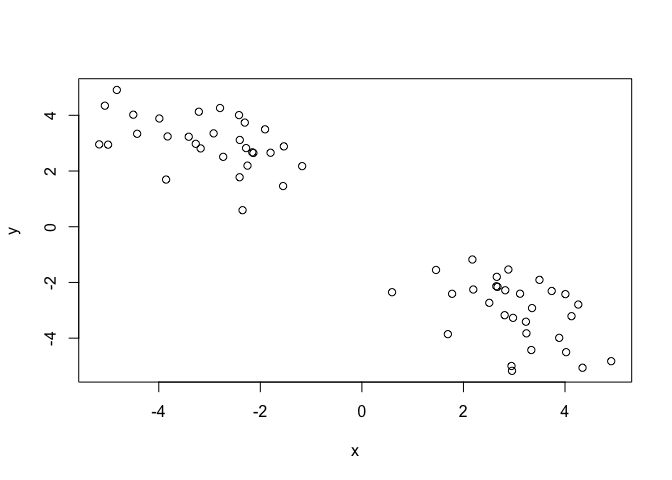
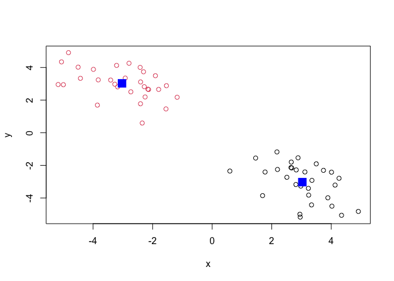
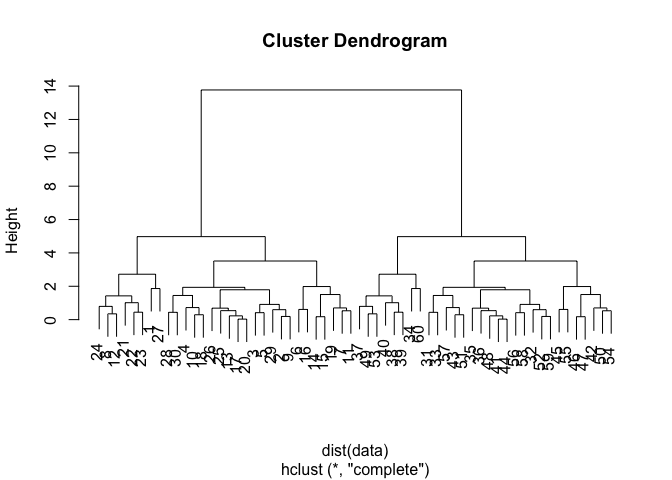
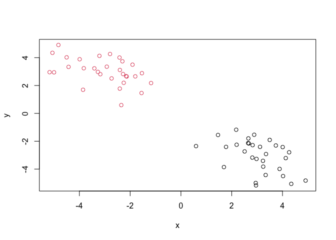
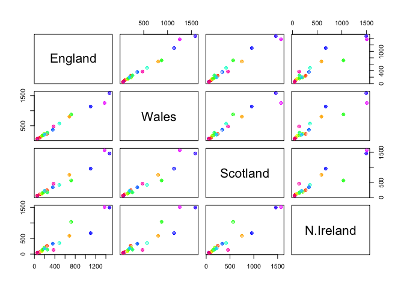
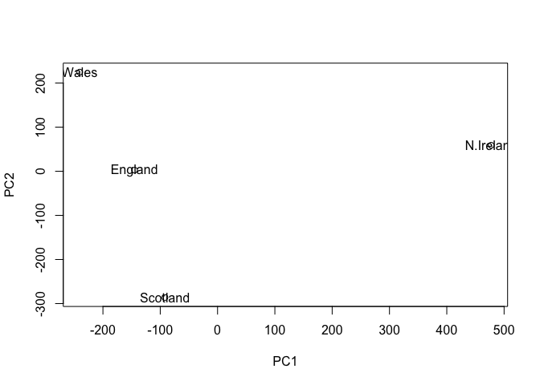
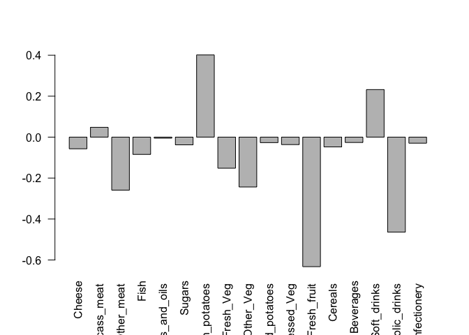
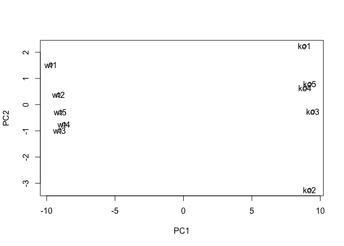

Machine Learning 1
================
Jose Chacon (PID A59010515)
10/22/2021

#Clustering methods

kmeans clusterin in R is done with the `kmeans()` function. Here we
makeup some data to test and learn with.

``` r
tmp <- c(rnorm(30,3), rnorm(30,-3) )
data <- cbind(x=tmp,y=rev(tmp)) #Note- making dataset with reverse order on y axis
plot(data)
```

<!-- -->

``` r
#hist(tmp)
```

Run `kmeans()` set Kto 2 nstart 20. The thing with kmeans is that you
have to tell it how many clusters you want.

``` r
km <- kmeans(data, centers=2, nstart=20)
km
```

    ## K-means clustering with 2 clusters of sizes 30, 30
    ## 
    ## Cluster means:
    ##           x         y
    ## 1  3.028124 -3.028446
    ## 2 -3.028446  3.028124
    ## 
    ## Clustering vector:
    ##  [1] 1 1 1 1 1 1 1 1 1 1 1 1 1 1 1 1 1 1 1 1 1 1 1 1 1 1 1 1 1 1 2 2 2 2 2 2 2 2
    ## [39] 2 2 2 2 2 2 2 2 2 2 2 2 2 2 2 2 2 2 2 2 2 2
    ## 
    ## Within cluster sum of squares by cluster:
    ## [1] 63.7339 63.7339
    ##  (between_SS / total_SS =  89.6 %)
    ## 
    ## Available components:
    ## 
    ## [1] "cluster"      "centers"      "totss"        "withinss"     "tot.withinss"
    ## [6] "betweenss"    "size"         "iter"         "ifault"

> Q1. How many points are in each cluster?

``` r
km$size
```

    ## [1] 30 30

> Q. What ‘component’ of your result object details cluster
> assignment/membership?

``` r
km$cluster
```

    ##  [1] 1 1 1 1 1 1 1 1 1 1 1 1 1 1 1 1 1 1 1 1 1 1 1 1 1 1 1 1 1 1 2 2 2 2 2 2 2 2
    ## [39] 2 2 2 2 2 2 2 2 2 2 2 2 2 2 2 2 2 2 2 2 2 2

> Q. What ’component’of your result object details cluster center?

``` r
km$centers
```

    ##           x         y
    ## 1  3.028124 -3.028446
    ## 2 -3.028446  3.028124

> Q. Plot x colored by the kmeans cluster assignment and the cluster
> center as blue points

``` r
plot(data, col=km$cluster)
points(km$centers, col="blue", pch=15, cex=2)
```

<!-- -->

#Hierarchical clustering

We will use the ‘hclust()’ function on the same data as before and see
how this method works

``` r
hc <- hclust( dist(data) )
hc
```

    ## 
    ## Call:
    ## hclust(d = dist(data))
    ## 
    ## Cluster method   : complete 
    ## Distance         : euclidean 
    ## Number of objects: 60

hclust has a plot method

``` r
plot(hc)
```

<!-- -->

``` r
#obline(h=7), col"red") #visualize height cut
```

TO find our membership we need to “cut” the treeand for this we use the
`cutree()` function and tellthe height to cut it

``` r
cutree(hc, h=7)
```

    ##  [1] 1 1 1 1 1 1 1 1 1 1 1 1 1 1 1 1 1 1 1 1 1 1 1 1 1 1 1 1 1 1 2 2 2 2 2 2 2 2
    ## [39] 2 2 2 2 2 2 2 2 2 2 2 2 2 2 2 2 2 2 2 2 2 2

We can alse use `cutree()` and state thte number of k clusters we want..

``` r
grps <- cutree(hc, k=2)
```

``` r
plot(data, col=grps)
```

<!-- -->

#Notes from board kmeans(x, centers=?) hclust(dist(x))

#Principal Componenet Analysis (PCA)

Import data from CSV file

``` r
url <- "https://tinyurl.com/UK-foods"
x <- read.csv(url)
```

How many rows and cols?

``` r
dim(x)
```

    ## [1] 17  5

``` r
x[,-1]
```

    ##    England Wales Scotland N.Ireland
    ## 1      105   103      103        66
    ## 2      245   227      242       267
    ## 3      685   803      750       586
    ## 4      147   160      122        93
    ## 5      193   235      184       209
    ## 6      156   175      147       139
    ## 7      720   874      566      1033
    ## 8      253   265      171       143
    ## 9      488   570      418       355
    ## 10     198   203      220       187
    ## 11     360   365      337       334
    ## 12    1102  1137      957       674
    ## 13    1472  1582     1462      1494
    ## 14      57    73       53        47
    ## 15    1374  1256     1572      1506
    ## 16     375   475      458       135
    ## 17      54    64       62        41

``` r
rownames(x) <- x[,1]
x <- x[-1]
x #distructive way of writng
```

    ##                     England Wales Scotland N.Ireland
    ## Cheese                  105   103      103        66
    ## Carcass_meat            245   227      242       267
    ## Other_meat              685   803      750       586
    ## Fish                    147   160      122        93
    ## Fats_and_oils           193   235      184       209
    ## Sugars                  156   175      147       139
    ## Fresh_potatoes          720   874      566      1033
    ## Fresh_Veg               253   265      171       143
    ## Other_Veg               488   570      418       355
    ## Processed_potatoes      198   203      220       187
    ## Processed_Veg           360   365      337       334
    ## Fresh_fruit            1102  1137      957       674
    ## Cereals                1472  1582     1462      1494
    ## Beverages                57    73       53        47
    ## Soft_drinks            1374  1256     1572      1506
    ## Alcoholic_drinks        375   475      458       135
    ## Confectionery            54    64       62        41

``` r
url <- "https://tinyurl.com/UK-foods"
x <- read.csv(url, row.names=1)
x
```

    ##                     England Wales Scotland N.Ireland
    ## Cheese                  105   103      103        66
    ## Carcass_meat            245   227      242       267
    ## Other_meat              685   803      750       586
    ## Fish                    147   160      122        93
    ## Fats_and_oils           193   235      184       209
    ## Sugars                  156   175      147       139
    ## Fresh_potatoes          720   874      566      1033
    ## Fresh_Veg               253   265      171       143
    ## Other_Veg               488   570      418       355
    ## Processed_potatoes      198   203      220       187
    ## Processed_Veg           360   365      337       334
    ## Fresh_fruit            1102  1137      957       674
    ## Cereals                1472  1582     1462      1494
    ## Beverages                57    73       53        47
    ## Soft_drinks            1374  1256     1572      1506
    ## Alcoholic_drinks        375   475      458       135
    ## Confectionery            54    64       62        41

``` r
dim(x)
```

    ## [1] 17  4

ˆ

``` r
barplot( as.matrix(x), col=rainbow(17))
```

<!-- -->

``` r
barplot( as.matrix(x), col=rainbow(17), beside=TRUE)
```

<!-- -->

``` r
mycols <- rainbow( nrow(x))
pairs(x, col=mycols, pch=10)
```

<!-- -->

## PCA to the rescue!

Here we will use the base R function for PCA, which is called
`pccomp()`. This functions wants the transpose data

``` r
pca <- prcomp( t (x) )
summary(pca)
```

    ## Importance of components:
    ##                             PC1      PC2      PC3       PC4
    ## Standard deviation     324.1502 212.7478 73.87622 4.189e-14
    ## Proportion of Variance   0.6744   0.2905  0.03503 0.000e+00
    ## Cumulative Proportion    0.6744   0.9650  1.00000 1.000e+00

``` r
plot(pca)
```

<!-- -->

We want score plot (a.k.a. PCA plot). Basically of PC1 vs PC2

``` r
attributes(pca)
```

    ## $names
    ## [1] "sdev"     "rotation" "center"   "scale"    "x"       
    ## 
    ## $class
    ## [1] "prcomp"

we are after the pca$x compenent

``` r
plot(pca$x[,1:2])
text(pca$x[,1:2], labels = colnames(x))
```

<!-- -->

We can also examine the PCA “loadings”, which tell us how much the
original variables contribute to each new PC…

``` r
#par(mar=c(30,3,0.35,0)) #error
barplot(pca$rotation[,1], las=2)
```

<!-- -->

##One more PCA for today

``` r
url2 <- "https://tinyurl.com/expression-CSV"
rna.data <- read.csv(url2, row.names=1)
head(rna.data)
```

    ##        wt1 wt2  wt3  wt4 wt5 ko1 ko2 ko3 ko4 ko5
    ## gene1  439 458  408  429 420  90  88  86  90  93
    ## gene2  219 200  204  210 187 427 423 434 433 426
    ## gene3 1006 989 1030 1017 973 252 237 238 226 210
    ## gene4  783 792  829  856 760 849 856 835 885 894
    ## gene5  181 249  204  244 225 277 305 272 270 279
    ## gene6  460 502  491  491 493 612 594 577 618 638

``` r
nrow(rna.data)
```

    ## [1] 100

``` r
ncol(rna.data)
```

    ## [1] 10

``` r
colnames(rna.data)
```

    ##  [1] "wt1" "wt2" "wt3" "wt4" "wt5" "ko1" "ko2" "ko3" "ko4" "ko5"

``` r
pca.rna <- prcomp( t (rna.data), scale= TRUE)
summary(pca.rna)
```

    ## Importance of components:
    ##                           PC1    PC2     PC3     PC4     PC5     PC6     PC7
    ## Standard deviation     9.6237 1.5198 1.05787 1.05203 0.88062 0.82545 0.80111
    ## Proportion of Variance 0.9262 0.0231 0.01119 0.01107 0.00775 0.00681 0.00642
    ## Cumulative Proportion  0.9262 0.9493 0.96045 0.97152 0.97928 0.98609 0.99251
    ##                            PC8     PC9      PC10
    ## Standard deviation     0.62065 0.60342 3.348e-15
    ## Proportion of Variance 0.00385 0.00364 0.000e+00
    ## Cumulative Proportion  0.99636 1.00000 1.000e+00

``` r
plot(pca.rna)
```

<!-- -->

``` r
plot(pca.rna$x[,1:2])
text(pca.rna$x[,1:2], labels = colnames(rna.data)) #error
```

<!-- -->
