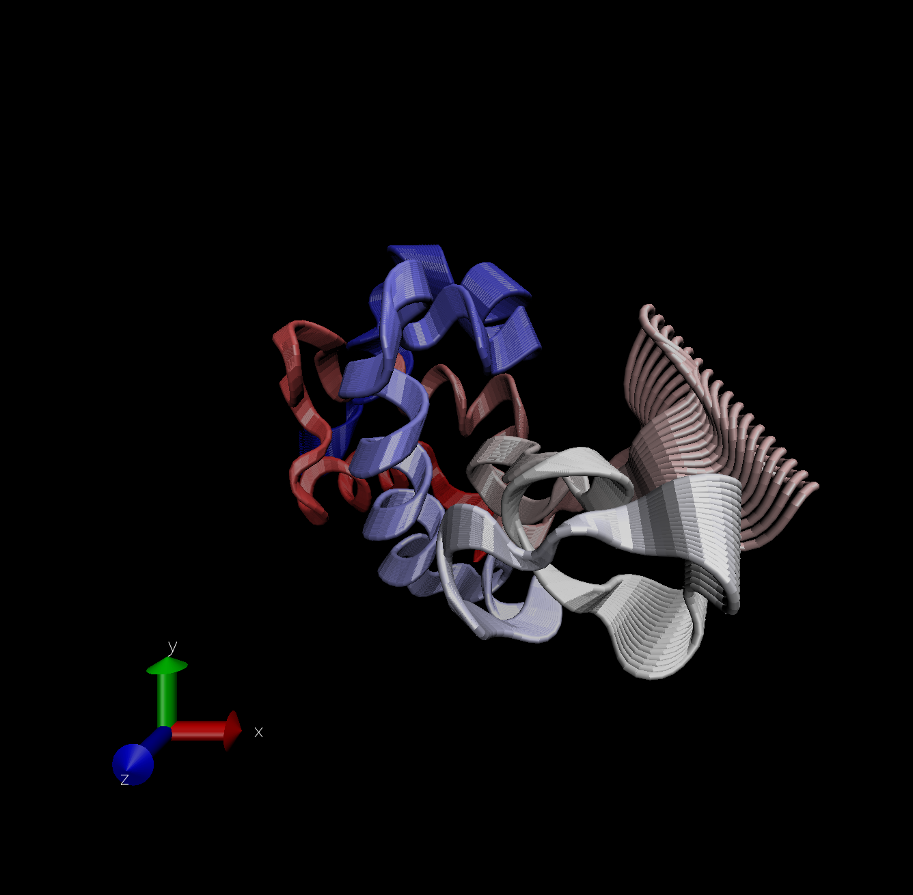

#working with biod3d

```{r}
library(bio3d)
pdb <- read.pdb("1hel")
pdb
```

```{r}
head(pdb$atom)
```

Let's do a quick bioinformatics prediction of protein dynamics (flexibility). We use the `nma()` function, which does Normal Mode Analysis.

```{r}
modes <- nma(pdb)
plot(modes)
```

Make a trajectory of this prediction with the \`mktrj()'.

```{r}
mktrj(modes, file="nma.pdb")
```

\

##Comparitive Strucutre Analysis

Start by getting a sequence of interest

```{r}
aa <- get.seq("1AKE_A")
aa
```

I want to search the PDB database (the main db for exp structures) for sequences like my aa sequence.

```{r}
blast <- blast.pdb(aa)
```

```{r}
plot(blast)
```

# Code here??

```{r}
#b <- blast.pdb(aa)
hits <- plot(blast)

```

Now I have my top gits from the search of the PDB

```{r}
hits$pdb.id
```

```{r}
#Download related PDB files
files <- get.pdb(hits$pdb.id, path="pdbs", split=TRUE, gzip=TRUE)

```

Now we want to align all these strucutres. We will use the function `pdbaln()`

```{r}
pdbs <- pdbaln(files, fit = TRUE)
```

Let's have a wee look see

```{r}
pdbs
```

```{r}
pdbs$xyz
```

## Principle Cpmponent Analysis (PCA)

Here we will do PCA on the xyz coordinate data of all these structures with the `pca()` function in biod3d.

```{r}
pc <- pca(pdbs)
plot(pc)
```

Let's visualize the displacements (i.e. movements of the structure) that are captured by PC1

```{r}
mktrj(pc, pc=1, file="pca.pdb")
```

Let's save our important results

```{r}
#save(blast, hits, pca, file="myresults.RData")
#load("myresults.RData")
```

Protein ELAV alphafold


