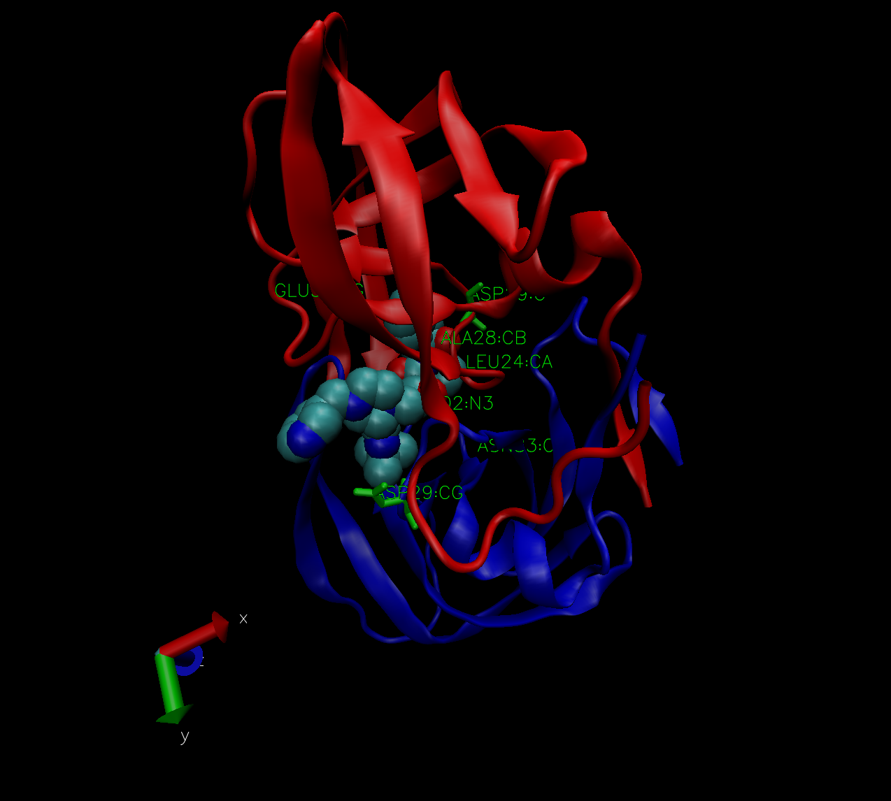

# The PDB database

```{r}
db <-  read.csv("Data Export Summary.csv", row.names=1)
```

> Q1: What percentage of structures in the PDB are solved by X-Ray and Electron Microscopy.

```{r}
a <- (sum(db$X.ray) + sum(db$EM))/ sum(db$Total) *100
a
```

```{r}
colSums(db)
```

> Q2: What proportion of structures in the PDB are protein?

```{r}
db$Total[1]/ sum(db$Total) *100
```

> Q3: Type HIV in the PDB website search box on the home page and determine how many HIV-1 protease structures are in the current PDB?

23409

> Q4: Water molecules normally have 3 atoms. Why do we see just one atom per water molecule in this structure?

Only oxygen is visible since hyrdogen bonds are smaller and harder to resolve. this structure is 1.9 angstroms.

> Q5: There is a conserved water molecule in the binding site. Can you identify this water molecule? What residue number does this water molecule have (see note below)?

resid 308

 


```{r}
library(bio3d)
pdb <- read.pdb("1hel")
pdb
```

>Q7: How many amino acid residues are there in this pdb object? 

198; 129

>Q8: Name one of the two non-protein residues?

HOH, MK1 ;hoh

>Q9: How many protein chains are in this structure?

2;1

```{r}
attributes(pdb)
```

```{r}
head(pdb$atom)
```
```{r}
#pdb$atom
```
Do a Normal Mode Analysis (NMA) a prediction of the conformational variablity and intrinsic dynamics of this protein
```{r}
m <- nma(pdb)
plot(m)
```
Make a little movie (trajectory) for viewing in VMD.
```{r}
mktrj(m,file="nma.pdb")
```

